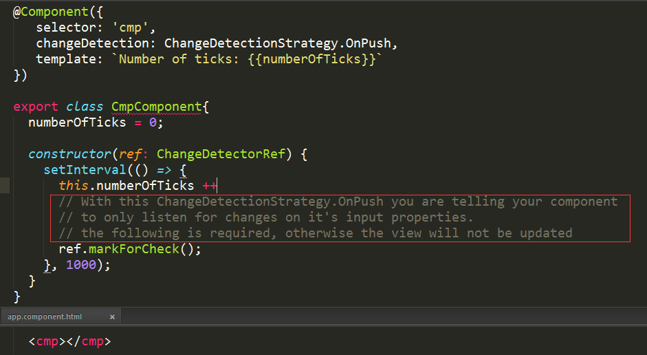
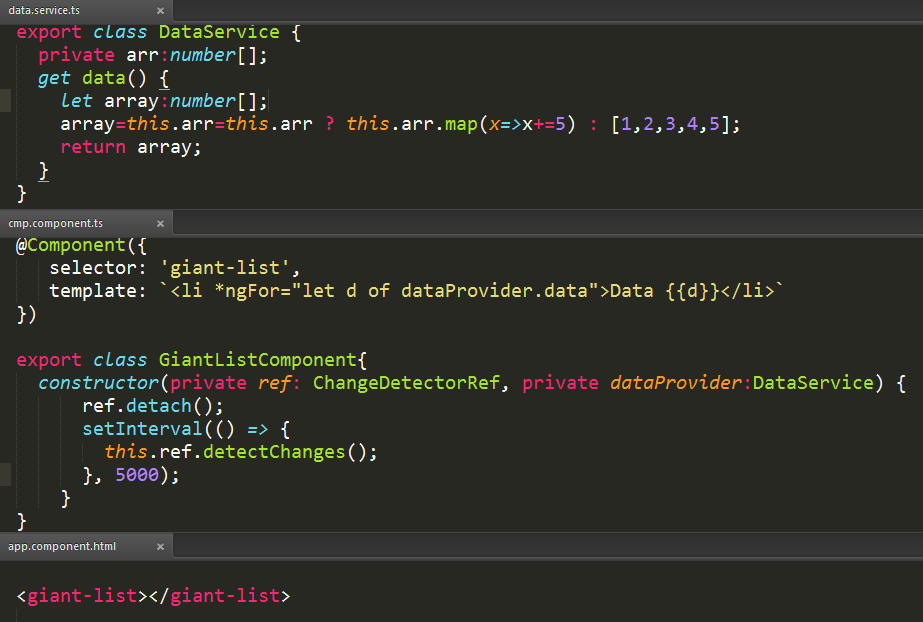
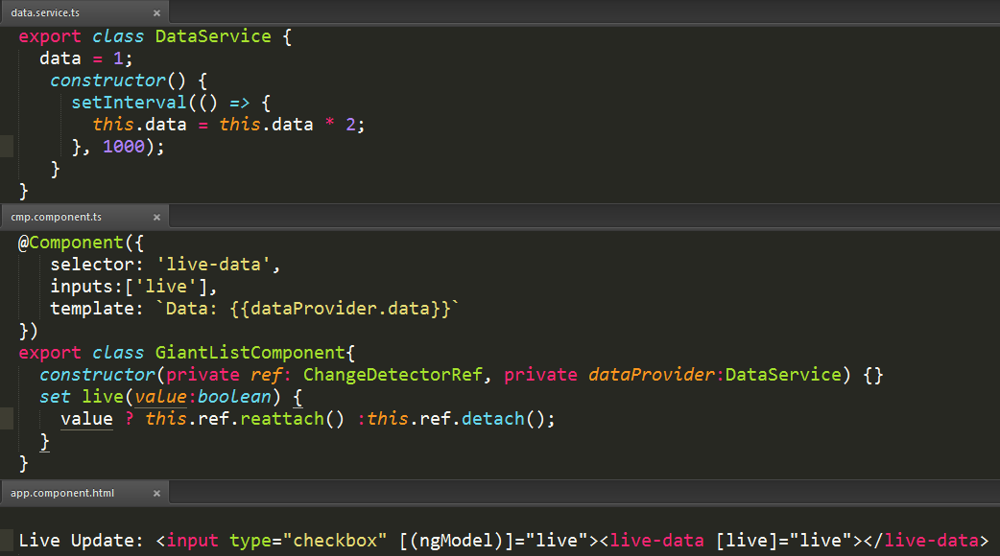

## ChangeDetectorRef 4/21/2017 12:52:43 AM 

>**object method**

	export class ChangeDetectorRef {
		markForCheck(): void,
		detach(): void,
		detectChanges(): void,
		checkNoChanges(): void,
		reattach(): void
	}

>**markForCheck**

Marks all {@link ChangeDetectionStrategy#OnPush} ancestors as to be checked.

#### Example

>**detach**

Detaches the change detector from the change detector tree.

The detached change detector will not be checked until it is reattached.

This can also be used in combination with {@link ChangeDetectorRef#detectChanges} to implement local change detection checks.

>**detectChanges**

Checks the change detector and its children.

This can also be used in combination with {@link ChangeDetectorRef#detach} to implement local change detection checks.

#### Example
For performance reasons,we want to check and update the list every five seconds. We can do that by detaching the component's change detector and doing a local check every five seconds.

>**checkNoChanges**

Checks the change detector and its children, and throws if any changes are detected.

This is used in development mode to verify that running change detection doesn't introduce other changes.

>**reattach**

Reattach the change detector to the change detector tree.

This also marks OnPush ancestors as to be checked. This reattached change detector will be checked during the next change detection run.

####Example

