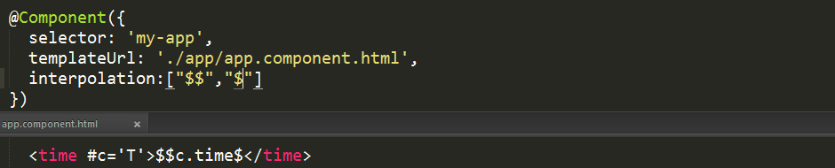

## Component extends Directive 4/16/2017 5:36:18 PM 

> **what it does**

Marks a class as an Angular component and collects component configuration
metadata.

> **how to use**

	import { Component } from '@angular/core';
	@Component({
		changeDetection?: ChangeDetectionStrategy,
		viewProviders?: Provider[],
		moduleId?: string,
		templateUrl?: string,
		template?: string,
		styleUrls?: string[],
		styles?: string[],
		animations?: AnimationEntryMetadata[],
		encapsulation?: ViewEncapsulation,
		interpolation?: [string, string],
		entryComponents?: Array<Type<any> | any[]>
	})
	export class MyComponent{
	}

>**description**

A component must belong to an NgModule in order for it to be usable by another component or application. To specify that a component is a member of an NgModule

you should list it in the `declarations` field of that NgModule.

>**metadata properties**

`animations` - list of animations of this component

`changeDetection` - change detection strategy used by this component

`encapsulation` - style encapsulation strategy used by this component

`entryComponents` - list of components that are dynamically inserted into the view of this component

`exportAs` - name under which the component instance is exported in a template

`host` - map of class property to host element bindings for events, properties and attributes

`inputs` - list of class property names to data-bind as component inputs

`interpolation` - custom interpolation markers used in this component's template

`moduleId` - ES/CommonJS module id of the file in which this component is defined

`outputs` - list of class property names that expose output events that others can subscribe to

`providers` - list of providers available to this component and its children

`queries` -  configure queries that can be injected into the component

`selector` - css selector that identifies this component in a template

`styleUrls` - list of urls to stylesheets to be applied to this component's view

`styles` - inline-defined styles to be applied to this component's view

`template` - inline-defined template for the view

`templateUrl` - url to an external file containing a template for the view

`viewProviders` - list of providers available to this component and its view children

>**changeDetection**

The `changeDetection` property defines, whether the change detection will be checked every time or only when the component tells it to do so.

>**interpolation**

Overrides the default encapsulation start and end delimiters (respectively `{{` and `}}`)

>**viewProviders**

Defines the set of injectable objects that are visible to its view DOM children.

>**moduleId**

Needed to be able to resolve relative urls for templates and styles.

In CommonJS, this can always be set to `module.id`, similarly SystemJS exposes `__moduleName` variable within each module.

      @Directive({
        selector: 'someDir',
        moduleId: module.id
      })
      class SomeDir {
      }
     
>**templateUrl**

Only one of `templateUrl` or `template` can be defined per View.

>**template**

Only one of `templateUrl` or `template` can be defined per Component.

>**styleUrls**

Specifies stylesheet URLs for an Angular component.

>**styles**

Specifies inline stylesheets for an Angular component.

>**entryComponents**

Defines the components that should be compiled as well when this component is defined. For each components listed here, Angular will create a {@link ComponentFactory} and store it in the {@link ComponentFactoryResolver}.

>**encapsulation**

Specifies how the template and the styles should be encapsulated:

- {@link ViewEncapsulation#Native `ViewEncapsulation.Native`} to use shadow roots ,only works if natively available on the platform,

- {@link ViewEncapsulation#Emulated `ViewEncapsulation.Emulated`} to use shimmed CSS that emulates the native behavior,

- {@link ViewEncapsulation#None `ViewEncapsulation.None`} to use global CSS without any encapsulation.

When no `encapsulation` is defined for the component, the default value from the {@link CompilerConfig} is used. The default is `ViewEncapsulation.Emulated`. Provide a new `CompilerConfig` to override this value.

If the encapsulation is set to `ViewEncapsulation.Emulated` and the component has no `styles` nor `styleUrls` the encapsulation will automatically be switched to `ViewEncapsulation.None`.

>**animations**

### DSL Animation Functions

- {@link trigger trigger()}
- {@link state state()}
- {@link transition transition()}
- {@link group group()}
- {@link sequence sequence()}
- {@link style style()}
- {@link animate animate()}
- {@link keyframes keyframes()}

For animations to be available for use, animation state changes are placed within {@link trigger animation triggers} which are housed inside of the `animations` annotation metadata. Within a trigger both {@link state state} and {@link transition transition} entries can be placed.

      @Component({
        selector: 'animation-cmp',
        templateUrl: 'animation-cmp.html',
        animations: [
          // this here is our animation trigger that
          // will contain our state change animations.
          trigger('myTriggerName', [
            // the styles defined for the `on` and `off`
            // states declared below are persisted on the
            // element once the animation completes.
            state('on', style({ opacity: 1 }),
            state('off', style({ opacity: 0 }),
    
            // this here is our animation that kicks off when
            // this state change jump is true
            transition('on => off', [
              animate("1s")
            ])
          ])
        ]
      })

When a trigger is created then it can be bound onto an element within the component's template via a property prefixed by an `@` symbol followed by trigger name and an expression that is used to determine the state value for that trigger.

    
...

