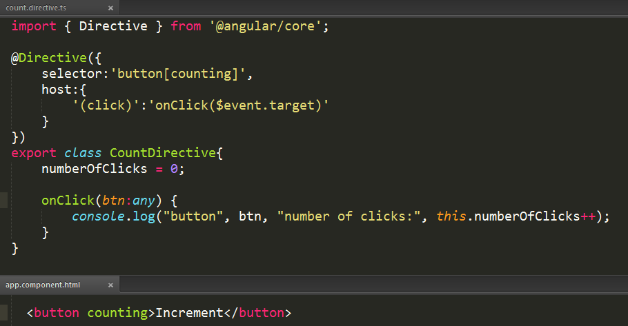
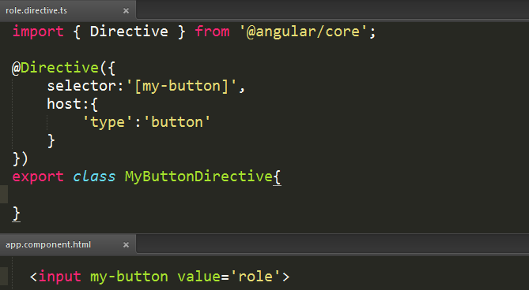
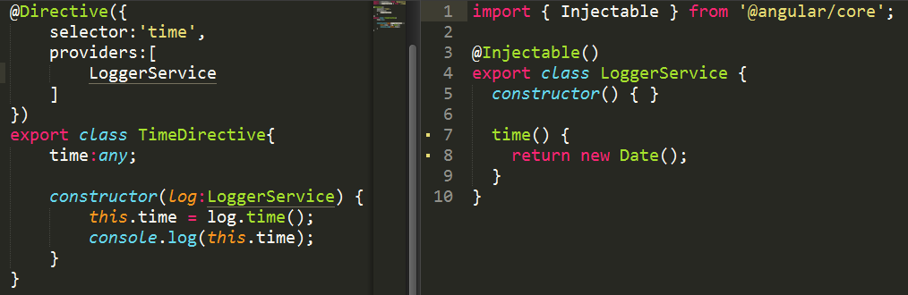
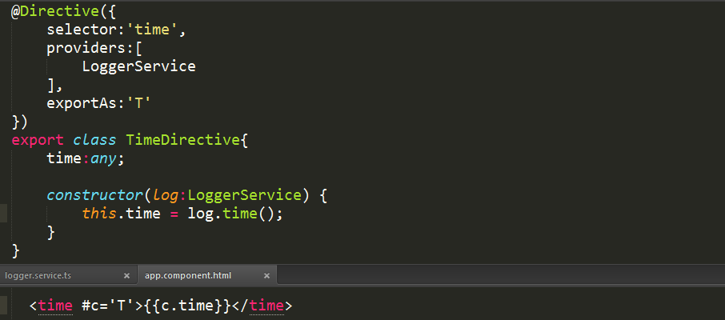

##Directive 4/16/2017 4:40:14 PM 

> **what it does**

Marks a class as an Angular directive and collects directive configuration metadata.

> **how to use**

	import { Directive } from '@angular/core';
	@Directive({
		selector?: string,
		inputs  ?: string[],
		outputs ?: string[],
		host	?: {
        	[key: string]: string
    	},
		providers?: Provider[],
		exportAs ?: string,
		queries  ?: {
        	[key: string]: any
    	}
	})
	export class MyDirective{
	}

>**description**

A directive must belong to an NgModule in order for it to be usable by another directive, component, or application. To specify that a directive is a member of an NgModule.

you should list it in the `declarations` field of that NgModule.

>**metadata properties**

`exportAs` - name under which the component  instance is exported in a template

`host` - map of class property to host element bindings for events, properties and attributes

`inputs` - list of class property names to data-bind as component inputs

`outputs` - list of class property names that expose output events that others can subscribe to

`providers` - list of providers available to this component and its children

`queries` -  configure queries that can be injected into the component

`selector` - css selector that identifies this component in a template

>**selector** 

may be declared as one of the following:

- `element-name`: select by element name.
- `.class`: select by class name.
- `[attribute]`: select by attribute name.
- `[attribute=value]`: select by attribute name and value.
- `:not(sub_selector)`: select only if the element does not match the `sub_selector`.
- `selector1, selector2`: select if either `selector1` or `selector2` matches.

>**inputs**

Enumerates the set of data-bound input properties for a directive

The `inputs` property defines a set of `directiveProperty` to `bindingProperty` configuration:

- `directiveProperty` specifies the component property where the value is written.
- `bindingProperty` specifies the DOM property where the value is read from.

When `bindingProperty` is not provided, it is assumed to be equal to `directiveProperty`.

>**outputs** 

Enumerates the set of event-bound output properties.

When an output property emits an event, an event handler attached to that event the template is invoked.

>**host**

- **host listeners**:

Specify the events, actions, properties and attributes related to the host element.

Specifies which DOM events a directive listens to via a set of `(event)` to `method`

key-value pairs:

- `event`: the DOM event that the directive listens to.
- `statement`: the statement to execute when the event occurs.

If the evaluation of the statement returns `false`, then `preventDefault`is applied on the DOM event.

- **host property binding**

Specifies which DOM properties a directive updates.

- **host attributes binding**

Specifies static attributes that should be propagated to a host element.

>**providers**

>**exportAs**

Defines the name that can be used in the template to assign this directive to a variable.

>**queries**

Configures the queries that will be injected into the directive.

- Content queries are set before the `ngAfterContentInit` callback is called.

- View queries are set before the `ngAfterViewInit` callback is called.
