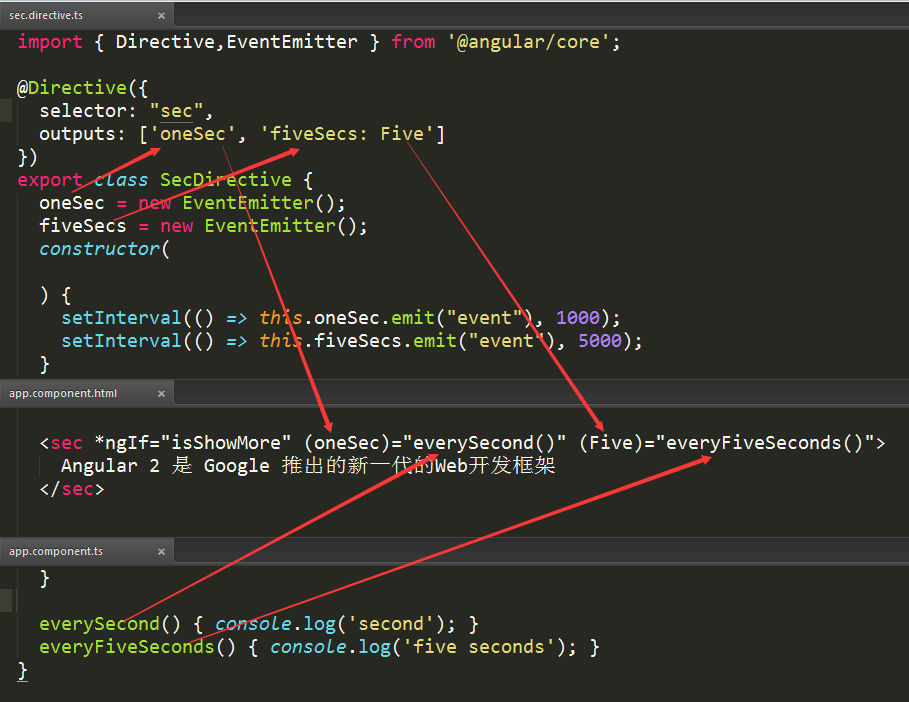

##Directive

> **what it does**

Marks a class as an Angular directive and collects directive configuration metadata.

> **how to use**

	import { Directive } from '@angular/core';
	@Directive({
		selector:'my-directive'
	})
	export class MyDirective{
	}

>**description**

A directive must belong to an NgModule in order for it to be usable by another directive, component, or application. To specify that a directive is a member of an NgModule.

you should list it in the `declarations` field of that NgModule.

>**metadata properties**

`exportAs` - name under which the component  instance is exported in a template

`host` - map of class property to host element bindings for events, properties and attributes

`inputs` - list of class property names to data-bind as component inputs

`outputs` - list of class property names that expose output events that others can subscribe to

`providers` - list of providers available to this component and its children

`queries` -  configure queries that can be injected into the component

`selector` - css selector that identifies this component in a template

>**selector** may be declared as one of the following:

- `element-name`: select by element name.
- `.class`: select by class name.
- `[attribute]`: select by attribute name.
- `[attribute=value]`: select by attribute name and value.
- `:not(sub_selector)`: select only if the element does not match the `sub_selector`.
- `selector1, selector2`: select if either `selector1` or `selector2` matches.

