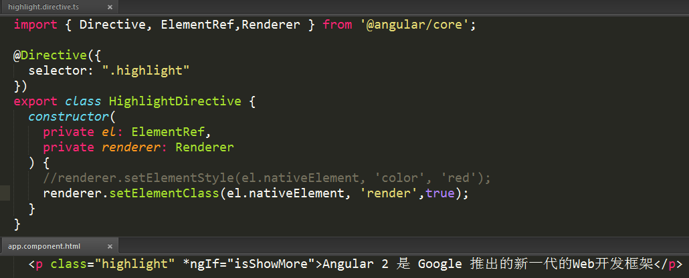

## Render 4/21/2017 1:22:30 PM 

#### RenderComponentType

	export class RenderComponentType {
	    id: string;
	    templateUrl: string;
	    slotCount: number;
	    encapsulation: ViewEncapsulation;
	    styles: Array<string | any[]>;
	    animations: {
	        [key: string]: Function;
	    };
	    constructor(id: string, templateUrl: string, slotCount: number, encapsulation: ViewEncapsulation, styles: Array<string | any[]>, animations: {
	        [key: string]: Function;
	    });
	}

#### RenderDebugInfo

	export class RenderDebugInfo {
	    injector: Injector;
	    component: any;
	    providerTokens: any[];
	    references: {
	        [key: string]: any;
	    };
	    context: any;
	    source: string;
	}

#### DirectRenderer [Use the `Renderer2` instead in version 4.0]

	export interface DirectRenderer {
	    remove(node: any): void;
	    appendChild(node: any, parent: any): void;
	    insertBefore(node: any, refNode: any): void;
	    nextSibling(node: any): any;
	    parentElement(node: any): any;
	}

#### Renderer [Use the `Renderer2` instead in version 4.0]

- `selectRootElement` (selectorOrNode: string | any, debugInfo?: RenderDebugInfo): any

- `createElement` (parentElement: any, name: string, debugInfo?: RenderDebugInfo): any

- `createViewRoot` (hostElement: any): any

- `createTemplateAnchor` (parentElement: any, debugInfo?: RenderDebugInfo): any

- `createText` (parentElement: any, value: string, debugInfo?: RenderDebugInfo): any

- `projectNodes` (parentElement: any, nodes: any[]): void

- `attachViewAfter` (node: any, viewRootNodes: any[]): void

- `detachView` (viewRootNodes: any[]): void

- `destroyView` (hostElement: any, viewAllNodes: any[]): void

- `listen` (renderElement: any, name: string, callback: Function): Function

- `listenGlobal` (target: string, name: string, callback: Function): Function

- `setElementProperty` (renderElement: any, propertyName: string, propertyValue: any): void

- `setElementAttribute` (renderElement: any, attributeName: string, attributeValue: string): void

- `setBindingDebugInfo` (renderElement: any, propertyName: string, propertyValue: string): void

- `setElementClass` (renderElement: any, className: string, isAdd: boolean): void

- `setElementStyle` (renderElement: any, styleName: string, styleValue: string): void

- `invokeElementMethod` (renderElement: any, methodName: string, args?: any[]): void

- `setText` (renderNode: any, text: string): void

- `animate` (element: any, startingStyles: AnimationStyles, keyframes: AnimationKeyframe[], duration: number, delay: number, easing: string): AnimationPlayer

#### Example

>**RootRenderer** [Use `RendererFactory2` instead in version 4.0]

If you are implementing a custom renderer, you must implement this interface.

The default Renderer implementation is `DomRenderer`. Also available is `WebWorkerRenderer`.

	export declare abstract class RootRenderer {
	    abstract renderComponent(componentType: RenderComponentType): Renderer;
	}

## Version 4.0

### RendererType2

	export interface RendererType2 {
	    id: string;
	    encapsulation: ViewEncapsulation;
	    styles: (string | any[])[];
	    data: {
	        [kind: string]: any;
	    };
	}

### RendererFactory2

	export class RendererFactory2 {
	    createRenderer(hostElement: any, type: RendererType2 | null): Renderer2;
	}

### RendererStyleFlags2

	export declare enum RendererStyleFlags2 {
	    Important = 1,
	    DashCase = 2,
	}

### Renderer2

This field can be used to store arbitrary data on this renderer instance.

This is useful for renderers that delegate to other renderers.

- [readonly] `data`: {[key: string]: any}
- `destroy()`: void
- `createElement`(name: string, namespace?: string | null): any
- `createComment`(value: string): any
- `createText`(value: string): any
- `destroyNode`: ((node: any) => void) | null
- `appendChild`(parent: any, newChild: any): void
- `insertBefore`(parent: any, newChild: any, refChild: any): void
- `removeChild`(parent: any, oldChild: any): void
- `selectRootElement`(selectorOrNode: string | any): any
- `parentNode`(node: any): any
    
- `nextSibling`(node: any): any
- `setAttribute`(el: any, name: string, value: string, namespace?: string | null): void
- `removeAttribute`(el: any, name: string, namespace?: string | null): void
- `addClass`(el: any, name: string): void
- `removeClass`(el: any, name: string): void
- `setStyle`(el: any, style: string, value: any, flags?: RendererStyleFlags2): void
- `removeStyle`(el: any, style: string, flags?: RendererStyleFlags2): void
- `setProperty`(el: any, name: string, value: any): void
- `setValue`(node: any, value: string): void
- `listen`(target: 'window' | 'document' | 'body' | any, eventName: string, callback: (event: any) => boolean | void): () => void
